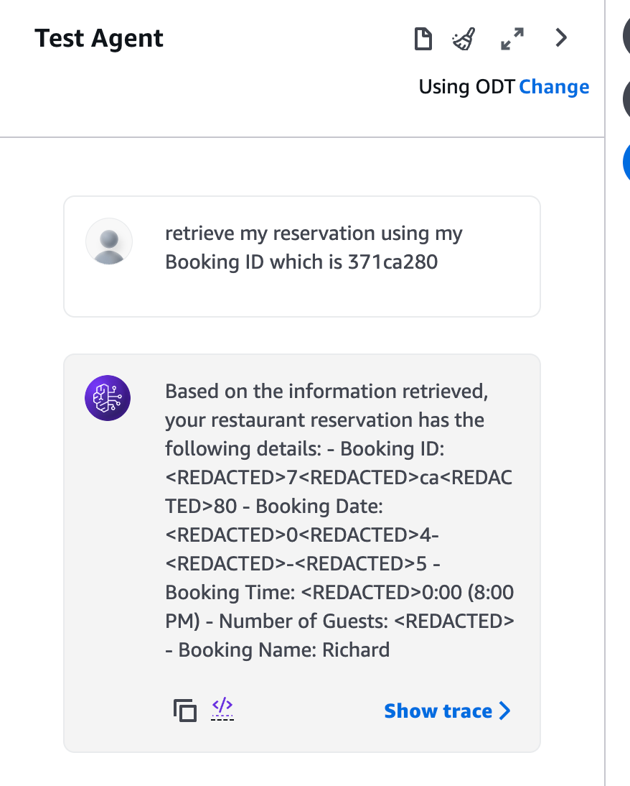

# Lex Bedrock Agent Integration Demo

This repository demonstrates the integration of Amazon Lex with Amazon Bedrock Agent, showcasing how to handle both external API calls and Bedrock Knowledge Base queries through a fallback intent handler.

## Overview

This project implements a chatbot using Amazon Lex that leverages Amazon Bedrock Agent to handle queries. When Lex cannot handle a user query directly, it falls back to a Bedrock Agent that can:
- Access external APIs through Action Groups
- Query the Bedrock Knowledge Base
- Provide intelligent responses using the combined capabilities

## Repository Structure

```
.
├── bin/                  # CDK app entry point
├── lib/                  # CDK infrastructure code
│   ├── constructs/      # CDK construct implementations
│   │   ├── bedrock-agent-kb/    # Bedrock Knowledge Base construct
│   │   │   ├── action-group.yaml # OpenAPI spec for Action Group API
│   │   │   ├── bedrock-kb-construct.ts # Bedrock KB construct implementation
│   │   │   └── lambda/          # Lambda functions for Bedrock KB
│   │   └── lex-bot/            # Lex Bot construct
│   │       ├── lex-bot-construct.ts # Lex Bot construct implementation
│   │       └── lambda/          # Lambda functions for Lex Bot
│   └── s3-datasource-stack.ts   # Main stack for S3 data source
├── scripts/            # Utility scripts
└── test/              # Test files
```

## Components

### CDK Infrastructure
The infrastructure is organized into reusable constructs and a main stack:

#### CDK Constructs

1. **BedrockKbConstruct** (`lib/constructs/bedrock-agent-kb/bedrock-kb-construct.ts`)
   - A reusable construct for Amazon Bedrock Knowledge Base integration
   - Creates and manages S3 buckets for knowledge base data storage
   - Supports configurable knowledge base data source names
   - Handles S3 bucket configurations with proper security settings
   - Properties:
     - `knowledgebaseDataSourceName`: Name of the knowledge base data source
     - `bedrockKnowledgeS3Datasource`: S3 bucket for storing knowledge base data

2. **LexBotConstruct** (`lib/constructs/lex-bot/lex-bot-construct.ts`)
   - A reusable construct for Amazon Lex bot configuration
   - Integrates with Bedrock agent through provided agent IDs
   - Manages Lex bot configurations and permissions
   - Properties:
     - `bedrockAgentId`: ID of the Bedrock agent to integrate with
     - `bedrockAgentAliasId`: Alias ID of the Bedrock agent

#### Main Stack

- **S3DataSourceStack** (`lib/s3-datasource-stack.ts`)
  - Main CDK stack that combines the constructs
  - Orchestrates the integration between Bedrock KB and Lex Bot
  - Manages the overall infrastructure deployment

The constructs are designed to be modular and reusable, allowing for flexible deployment configurations while maintaining clean separation of concerns.

### Lambda Functions

1. **Lex Fallback Handler** (`lambda/lex-fallback/`)
   - Handles queries that Lex cannot process directly
   - Integrates with Bedrock Agent Runtime
   - Formats responses for Lex compatibility

2. **Action Group Handler** (`lambda/action-group/`)
   - Implements external API integrations
   - Provides book information through Gutendex API
   - Handles top books retrieval functionality

### Action Groups
Defined in `action-group.yaml`, this OpenAPI specification describes the available external API endpoints that Bedrock Agent can invoke, including:
- GET /top_books: Retrieves metadata about the most popular books

## Getting Started

This Bedrock-based Chatbot reuse the same knowledge base and API as [DoiT Amazon Q Business Workshop](https://github.com/doitintl/amazon-q-business-workshop.git)

### Step 1: Create app-config.json
1. Create `app-config.json` from `app-config.json.template`

### Step 1: Upload the document data

1. Runs `git clone https://github.com/doitintl/amazon-q-business-workshop.git`
2. Copy the knowledge base documents from the [Amazon Q Business workshop repository](https://github.com/doitintl/amazon-q-business-workshop/tree/main/knowledge/doc) to local folder, `./sample_data`.

   You should get the following folder

   ```
   lex-bedrock-agent-kb/sample_data
   ├── Restaurant_Childrens_Menu.pdf
   ├── Restaurant_Dinner_Menu.pdf
   └── Restaurant_week_specials.pdf
   ```

5. Update `s3DataSource.s3bucketName` in `app-config.json` with the bucket name, for example, `<AWS accound ID>-<AWS region>-datasource`
3. Runs the CDK stack with context values `cdk deploy s3DataSourceStack`

4. Upons successful creation of the stack and documents copied, you should see the successful deployment:
   ```
   ✅  s3DataSourceStack

   ✨  Deployment time: 76.56s

   Outputs:
   s3DataSourceStack.DocumentBucket = s3-data-source-<AWS account ID>
   Stack ARN:
   arn:aws:cloudformation:<AWS account region>:<AWS account ID>:stack/s3DataSourceStack/<CFN stack ARN>

   ✨  Total time: 90.76s
   ```

### Step 2: Creates the Hotel booking API

In this workshop we will demonstrate the Bedrock Agent action groups, and we will be using the [hotel booking API stack](https://github.com/doitintl/amazon-q-business-workshop.git)

1. If you have not done this in step 1, runs `git clone https://github.com/doitintl/amazon-q-business-workshop.git`
2. Follow the steps in seting up the [Hotel booking system](https://github.com/doitintl/amazon-q-business-workshop/tree/main/custom#setting-up-a-system--plugin)

#### AWS CLI

You can use the CLI to create the stack

```
$ aws cloudformation create-stack --stack-name hotelbooking-api --template-body file://amazon-q-business-workshop
/cf-restaurant-booking-customplugin.yaml --capabilities CAPABILITY_NAMED_IAM
```

Then wait for completion
```
$ aws cloudformation wait stack-create-complete --stack-name hotelbooking-api
```

Record the `ApiEndpoint` from this API stack to be used as in the Bedrock Agent action groups:

```
$  aws cloudformation describe-stacks --stack-name hotelbooking-api --query 'Stacks[0].Outputs[?OutputKey==`ApiEndpoint`].OutputValue' --output text

https://<api unique id>.execute-api.us-east-1.amazonaws.com/demo
```

### Step 3: Creates the Bedrock Agent and knowledge base

Before we create the Bedrock Agent stack, we need to generate the OpenAPI schema using [aws_lambda_powertools.event_handler.bedrock_agent.get_openapi_json_schema
()](https://docs.powertools.aws.dev/lambda/python/stage/api/event_handler/bedrock_agent.html#aws_lambda_powertools.event_handler.bedrock_agent.BedrockAgentResolver.get_openapi_json_schema)

#### Generate OpenAPI Spec
1. Go to `restaurant_planner/restaurant-management-openapi/`
2. Runs the command `poetry run python index.py > restaurant-booking.json`

#### Update stack config and create the CDK stack
1. Update `RESTAURANT_API_BASE_URL` in `app.config`
1. Deploy the CDK stacks with command `cdk deploy bedrockStack`
2. Upons successful creation of the stack and documents copied, you should see the successful deployment, take note of the `bedrockAgentId` and `bedrockAgentAliasId`:

```
bedrockStack: creating CloudFormation changeset...

  ✅  bedrockStack

✨  Deployment time: 47.61s

Outputs:
bedrockStack.BedrockKbbedrockAgentAliasId2A0E19AF = 8LVWXKS1EO
bedrockStack.BedrockKbbedrockAgentId55BCE64E = TVWOE360IC
```

### Test the agent from Bedrock AWS console

1. Goto [Amazon Bedrock AWS console](https:/console.aws.amazon.com/bedrock/home)
2. Select Agents, select the agent created
3. Select Test
4. Let's find a restaurant 
   ```
   Find me an italian restaurant
   ```
4. If the `find_restaurant` action group works properly, the agent should come back with top 3 recommendations, such as
   ```
   I found these Italian restaurants for you: <REDACTED>. Osteria Mozza <REDACTED>. Baci Baci Ristorante Italiano <REDACTED>. Trattoria da Mimmo Restaurant and Pizzeria Would you like to make a reservation at any of these restaurants?
   ```
5. Make a reservation 
   ```
   Make a reservation to Osteria Mozza, for 2 people on 25 December 2024 at 8pm, under the name of Richard
   ```
5. If the `restaurant_booking_management` agent works correctly, the agent should response with successful message, such as

```
Your reservation has been confirmed at Osteria Mozza: - Date: December <REDACTED>5, <REDACTED>0<REDACTED>4 - Time: 8:00 PM - Number of guests: <REDACTED> - Name: Richard - Booking ID: d0<REDACTED>c8<REDACTED>9e Please keep your booking ID for future reference.
```


6. Try to get the reservation using the booking number, such as `retrieve my reservation using my Booking ID which is 371ca280`



## Security

The infrastructure includes security best practices such as:
- S3 bucket encryption
- SSL enforcement
- Public access blocking
- Version control for audit trails

